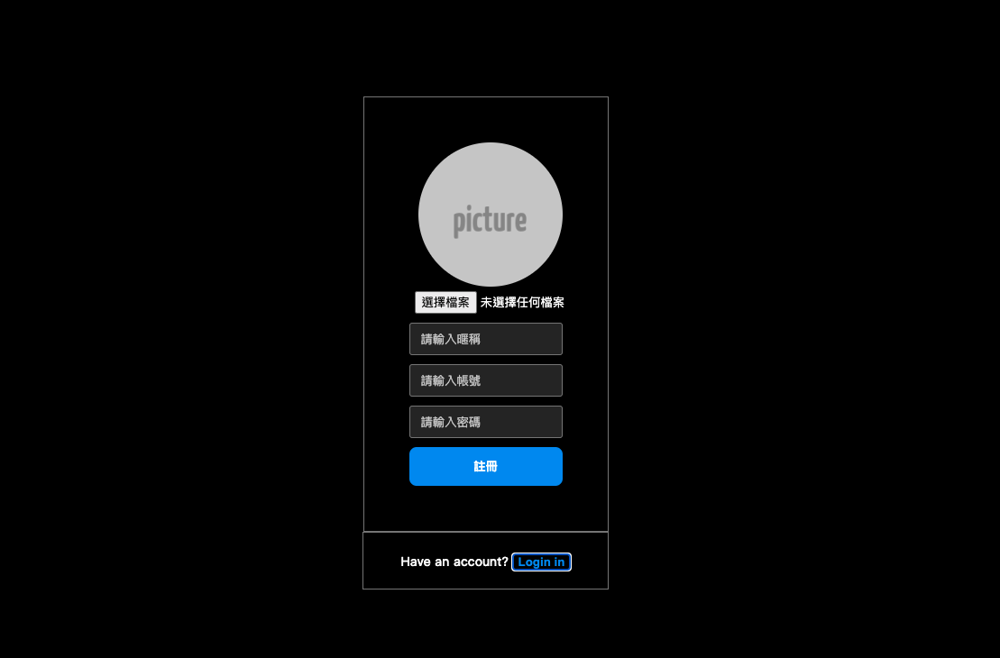
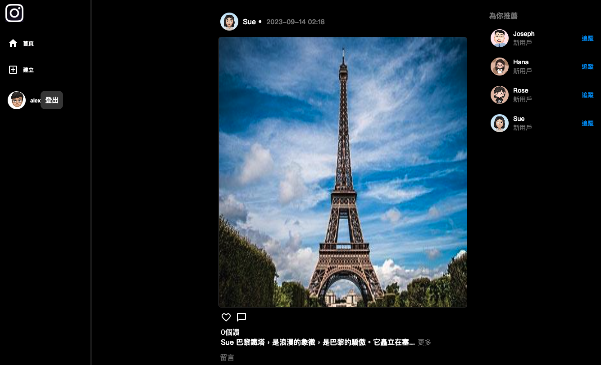

## Vinstagram

Vinstagram是一個由Instagram發想的社群平台，提供用戶註冊登入後瀏覽、發佈貼文，也可以對貼文按讚、留言，也可以追蹤其他使用者，而本Repo是前端網頁，使用React打造

## 網站連結
[網站連結] (http://vinstagram.ap-northeast-2.elasticbeanstalk.com/home/main)
[後端Repo] (https://github.com/popojk/vinstagram-api)

## 網站介紹
登入頁面

註冊頁面

主頁面

建立貼文


## 在本地運行專案

打開 terminal，將本專案 clone 至本地
```
git clone https://github.com/popojk/vinstagram-frontend
```

下載套件
```
npm install
```

啟動專案
```
npm start
```


## 使用技術

| 技術                | 用途                |
| ------------------ | ------------------- |
|React               |前端框架              |
|Redux               |狀態管理              |

